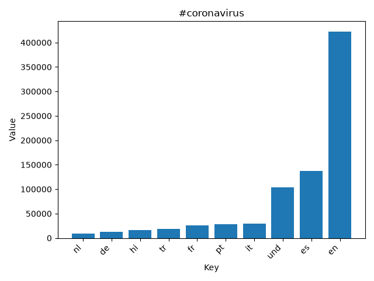
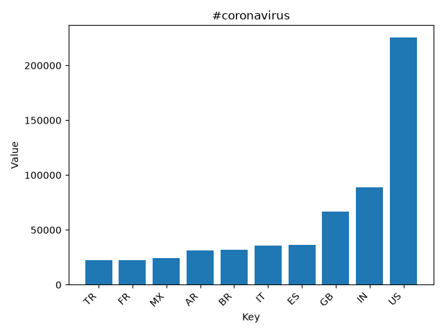
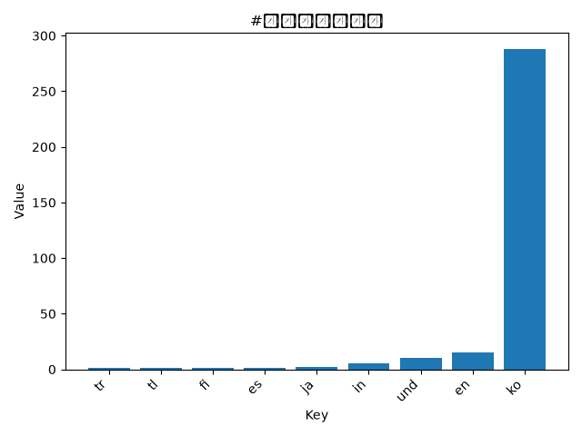
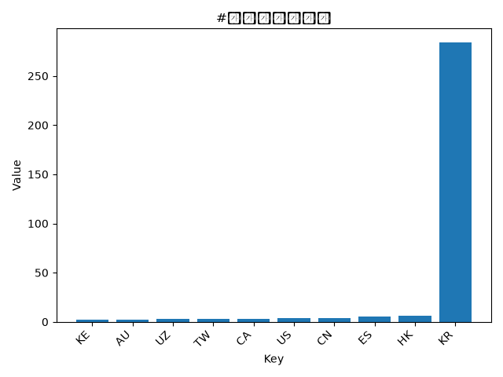
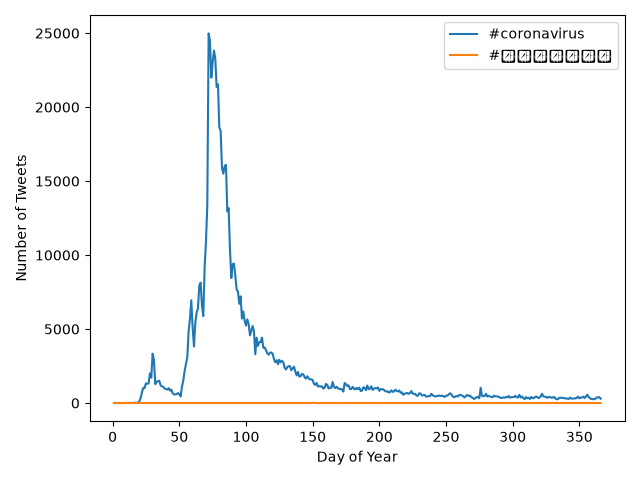

# Coronavirus Twitter Analysis

This project analyzes geotagged Twitter data from 2020 to study coronavirus-related hashtag usage across languages, countries, and time.

The dataset contains approximately 1.1 billion geotagged tweets from 2020. The analysis processes daily tweet files, aggregates hashtag counts by language and country, and creates visualizations showing both geographic patterns and changes in hashtag usage over time.

## Project Structure

- `map.py`  
  Processes one day of tweets and counts hashtag usage by language and country.

- `run_maps.sh`  
  Runs `map.py` across all 2020 tweet files using parallel background processes.

- `reduce.py`  
  Combines the daily `.lang` and `.country` output files into yearly totals.

- `visualize.py`  
  Creates bar charts showing the top 10 languages or countries for a given hashtag.

- `alternative_reduce.py`  
  Creates a line plot showing daily hashtag usage throughout 2020.

## Visualizations

### #coronavirus by Language

### #coronavirus by Country

### #코로나바이러스 by Language

### #코로나바이러스 by Country

### Hashtag Usage Over Time

